# Using Konga for Service and Router

Konga가 정상으로 설치되고 localhost:1337 에 정상적으로 접근이 되면 다음 화면을 볼 수 있다. 

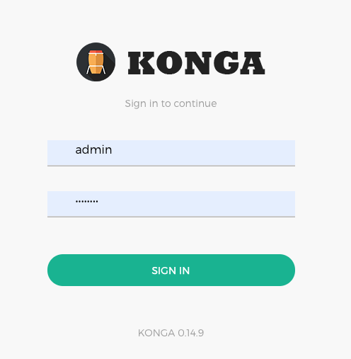

사용자 아이디를 admin 으로 지정하고 암호도 입력 했으며, 정상적으로 접근이 되면 다음과 같이 메인 대시보드를 확인할 수 있다. 

## Main Dashboard

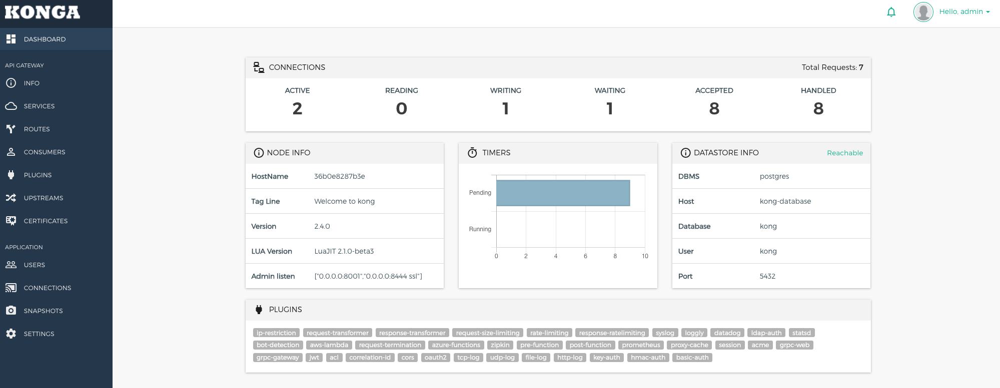

- Konga Dashboard에서는 연결된 클라이언트, Kong Gateway node, 현재 상태, 데이터베이스 상태, 플러그인 상태등을 확인할 수 있다. 


## 상세 Kong Gateway 의 정보 

아래와 같이 Kong Gateway 의 환경설정 정보들을 확인할 수 있다. 

해당 내역은 nginx 의 여러 속성들과 매치 된다. 

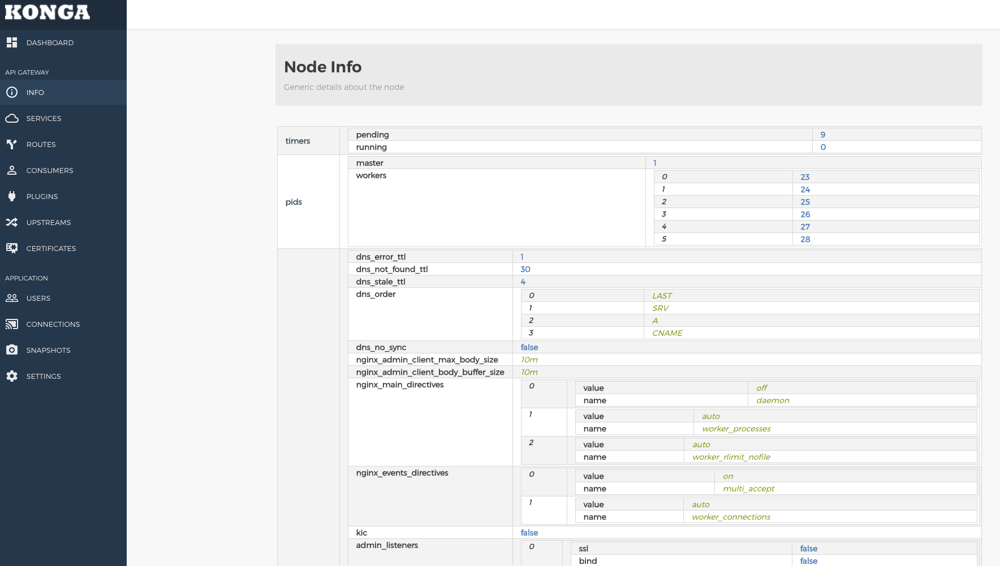

## Service

Kong에서 Service 는 Gateway 뒷단에 취이한 어플리케이션 서버를 이야기한다.

이는 각 업 스트림 서비스의 추상화이며, 예를 들면 마이크로 서비스 빌링 API 등이 이에 해당한다. 

꼭 직접 운영하는 서비스 이외에 다른 서비스를 등록할 수 있다. 

### Service 메인 페이지 

화면과 같이 몇가지 서비스를 이미 등록해 두었다. 

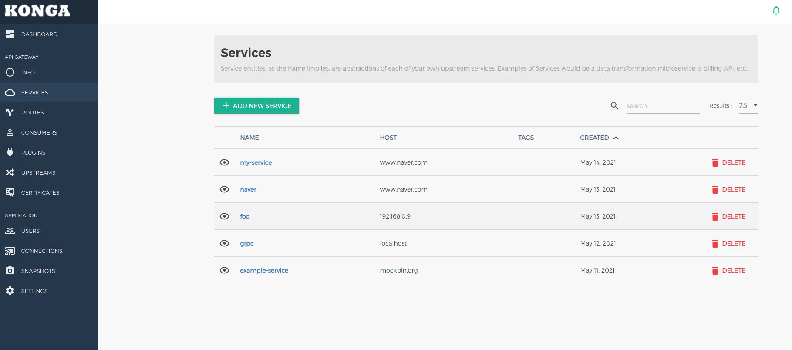

### Service 등록하기. 

이제 직접 서비스를 등록해 볼 것이다. "+ ADD NEW SERVICE" 버튼을 클릭하면 아래와 같이 서비스 등록 화면이 나온다. 

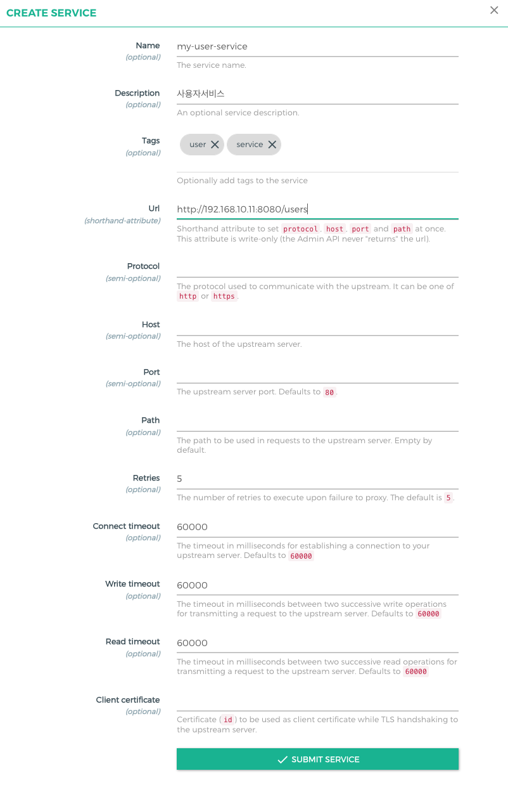

- Name: 서비스 이름을 기술한다. (옵션)
- Description: 서비스를 설명하는 설명문 (옵션)
- Tags: 서비스를 검색하기 위한 태그를 등록한다. 타이핑하고 엔터를 누르면 등록이 된다. (옵션)
- Url: short hand 속성으로 protocol, host, port 그리고 path 를 한번에 입력한다. 예를 들어 'http://192.168.10.11:8080/users' 와 같이 접속 엔드포인트를 직접 넣어주면 된다. 
- Protocol: Url 이 지정되지 않았다면 프로토콜을 지정할 수 있다. http/https 등을 기입하면 된다. (세미 옵션)
- Host: 업스트림 서버의 호스트 이름을 기술한다. (세미 옵션)
- Port: 업스트림 서버의 포트를 기술한다. (세미 옵션)
- Path: 업스트림 서버에서 지정한 경로를 기술한다. 기본값은 비어 있다. (옵션)
- Retries: 프록시가 실패되면 재시도 횟수이다. 기본 5 (옵션)
- Connect timeout: 업스트림 서버에 접속을 대기하는 시간, 밀리세컨단위, 기본 60000 으로 60초이다. (옵션)
- Write timeout: 업스트림 서버로 요청을 정상으로 보내기 까지 대기 시간, 밀리세컨단위, 기본 60000으로 60초이다. (옵션)
- Read timeout: 업스트림 서버로 부터 요청에 대한 응답 결과를 읽을때 까지 대시 시간, 밀리세컨단위, 기본 60000으로 60초이다. (옵션)
- Client certificate: 인증 아이디로, 업스트림 서버와 TLS 핸드쉐이킹시 필요한 인증 아이디이다. (옵션)

위와 같이 필요한 값을 입력하고, 'SUBMIT SERVICE' 를 클릭하여 등록한다. 

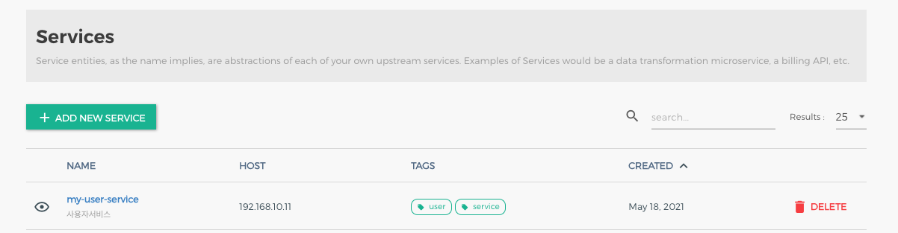

우리가 만든 서비스를 확인할 수 있다. 

### Sevice 상세 보기 

조금전 등록한 Service 상세 정보를 확인할 수 있다. 

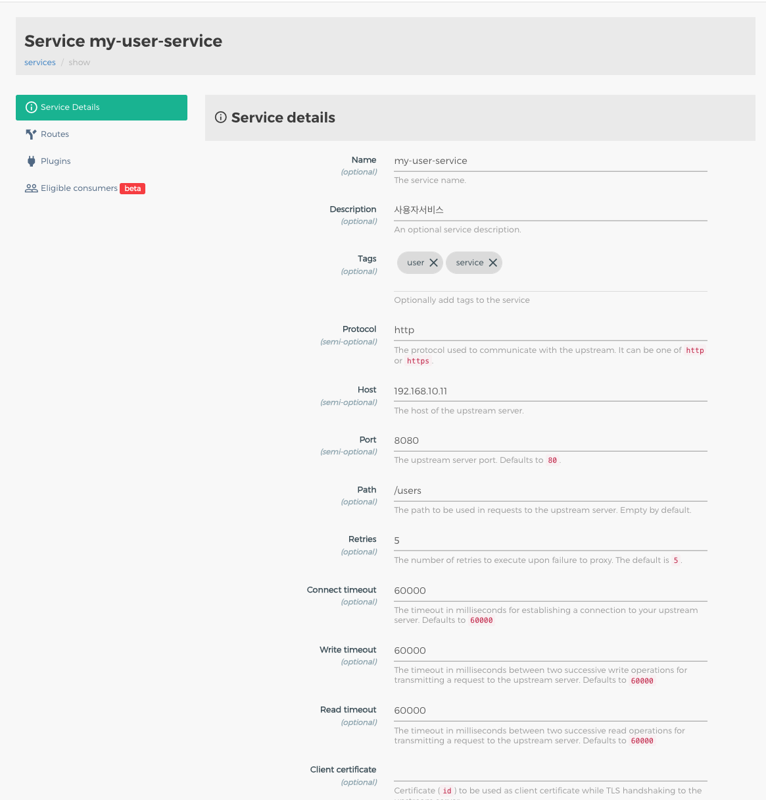

좌측 메뉴를 살펴보면 다음과 같다. 

- Service Details: 등록한 서비스 상세 정보를 볼 수 있다. 
- Routes: Kong에서 현재 서비스로 라우팅 설정 정보를 확인할 수 있다. 
- Plugins: 다양한 플러그인을 설치할 수 있다. (보안, 인증, ACL, 로깅등)
  
이제 필요한 것은 Routes 를 등록하는 것이다. 

## Route 등록하기. 

클라이언트 요청은 

```go
클라이언트 --> Kong Gateway [Route] --> 해당 Service 
```

의 순으로 전달이 된다. 

이제는 Route를 등록하자. 

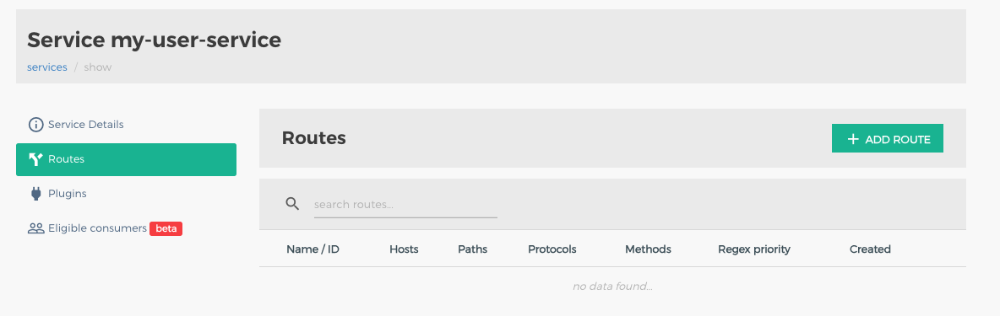

현재 사비스에 라우트가 등록되어 있지 않다. 

### Route 등록하기. 

라우트를 만들어야 하기 때문에 'ADD ROUTE' 를 등록하자. 

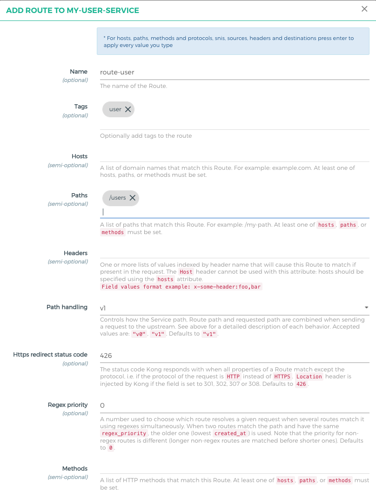
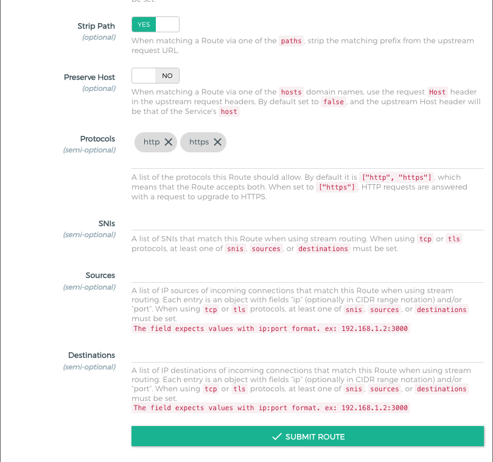

- Name: Route 의 이름 (옵션)
- Tags: Route를 검색할 수 있는 태그 등록 (옵션)
- Hosts: 도메인 이름의 리스트이다. 이는 현재 Route에 매치 된다. 예를 들어 example.com 등이 될 수 있다. 최소한 hosts, paths, methods중 하나는 반드시 추가 되어야한다.
- Paths: 라우트를 위한 패스 목록이다. 최소한 hosts, paths, methods중 하나는 반드시 추가 되어야한다. 우리 예제에서는 /users 라고 지정해 주었다. 이렇게 되면 http://localhost:8000/users 로 요청이 들어오면, users 서비스로 라우팅 된다. 
- Headers: 헤더 이름에 의한 인덱스된 값들의 목록으로, 만약 요청내부에 있는경우 경로가 일치하도록 한다. Host 헤더는 이 속성과 함께 사용할 수 없다. 호스트는 속성을 사용하여 지정해야한다. 필드 포맷 예: x-some-header:foo,bar 
- Path handling: 업스트림에 보낼 요청을 보낼 때 서비스 경로, 라우트 경로, 그리고 요청 경로가 서로 결합되는지를 컨트롤 한다. 각 동작에 대한 자세한 설명은 위 참조, 허용되는 값은 "v0", "v1" 이며, 기본값은 "v1"이다.
- Https redirect status code: 리다이렉션할 상태코드로 HTTPS대신에 HTTP가 요청으로 들어오고 필드가 301, 302, 307, 308로 설정된 경우라면 로케이션 헤더가 Kong에 의해서 인젝트 된다. 기본값은 426이다. 
- Regex priority: 라우터가 요청 경로를 해석했을때 regex 에 동일하게 매칭되는 경우 우선순위를 지정한다. 만약 regex_priority 역시 동일하다면, 생성된 날짜가 가장 오래된 것이 먼저 적용된다. regex 가 아니라면 가장 긴 경로의 라우트 경로가 먼저 채택된다. 기본값은 0이다. 
- Methods: HTTP 메소드의 목록이다. 적어도 hosts, paths, methods 중 하나는 세팅되어야한다. 
- Strip Path: paths 중에 하나로 매칭될때, strip는 매치된 prefix 를 업스트림 URL에서 제거한다. 
- Preserve Host: 호스트 도메인 이름 중 하나를 통해 경로를 일치 시킬때, 업스트림 요청 헤더에서 요청 호스트 헤더를 사용한다. 기본적으로는 false이며, 업스트림 호스트 헤더는 서비스 호스트가 된다. 
- Protocols: 허용할 프로토콜을 지정한다. 기본값은 ["http", "https"] 이다. 
- SNIs: SNI의 리스트로 스트림 라우팅을 이용할 때 현재 라우팅에 매치 된다. tcp나 tls 프로토콜을 이용할때 적어도 snis 하나는 필요하다. source 나 destinations가 세팅 되어야한다. 
- Sources: 들어오는 커넥션 소스 IP 리스트로, 스트림 라우팅을 이용할때 사용한다. 각 엔트리는 ip 로 채워져야하며, 선택적으로 CIDR 범위를 이용할 수 있다. tcp, tls 프로토콜을 이용한다면 snis, sources, destinations 중 하나는 세팅 되어야한다. 필드 값은 ip:port 형태로 예를 들면 192.168.1.2:3000 의 형태이다.
- Destinations: 목적지 IP 주소 목록이다. 이는 스트림 라우팅을 이용할때 세팅된다. 각 엔트리는 IP로 채워져야하며, 선택적으로 CIDR 범위를 이용할 수 있다. tcp, tls 프로토콜을 이용한다면 snis, sources, destinations 중 하나는 세팅 되어야한다. 필드 값은 ip:port 형태로 예를 들면 192.168.1.2:3000 의 형태이다.

### Route 등록 결과 보기. 

아래와 같이 우리가 등록한 Route목록을 볼 수 있다. 

이 내용으로 알 수 있는것은 하나의 서비스에 여래개의 route를 등록할 수 있다.

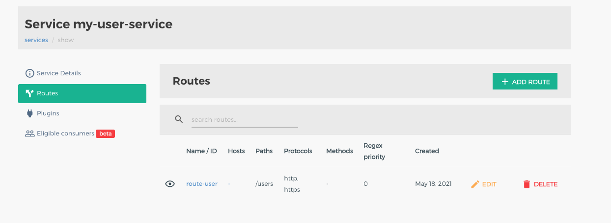


## 라우트 결과 테스트하기. 

```go
curl http://localhost:8000/users

HTTP/1.1 502 Bad Gateway
Server: openresty
Date: Mon, 17 May 2021 23:58:31 GMT
Content-Type: application/json; charset=utf-8
Connection: keep-alive
Content-Length: 75
X-Kong-Upstream-Latency: 1
X-Kong-Proxy-Latency: 2
Via: kong/2.4.0

{
  "message":"An invalid response was received from the upstream server"
}
```

우리는 임의의 존재하지 않는 서비스를 등록했으므로 502 Bad Gateway가 발생했다. 

### 정상 라우트 테스트하기. 

아직 연동할 서버가 없다면, 대표적인 서비스 도메인명을 이용해볼 수 있다. 

1. Service등록
   1. 위 서비스 내용을 참조하고, service url을 https://www.naver.com 이라고 등록하자. 
2. Route 등록
   1. 방금 등록한 서비스에 라우트를 등록한다. 
   2. 라우트 등록을 참조하여 paths에 /naver 라고 등록하자. 
3. 테스트 
   1. 브라우저에서 http://localhost:8000/naver 라고 하면, 메인 페이지가 나올 것이다. 


## WrapUp

지금까지 Konga를 이용하여 간단하게 Service와 Route를 등록해 보았다. 

이전 아티클과 다르게, UI를 이용하여 등록하면, 쉽게 서비스와 라우트를 가시적으로 등록할 수 있다. 