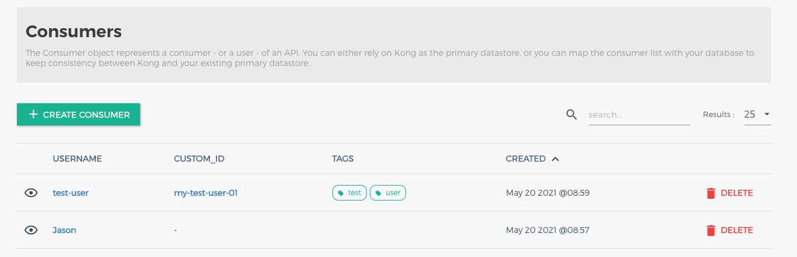

# Consumer 등록하기. 

Consumer는 Kong Gateway 를 이용하여 서비스를 라우팅할때, 특정 대상에 라우팅을 허용할지 여부를 적용할때, 적용 대상이 Consumer 이다. 

Consumer는 custom_id 를 발급하며, 이 custom_id 를 유니크하게 지정하면 컨슈머를 트래킹 할 수 있다. 

## Consumer 생성하기. 

### Curl 이용한 Consumer 등록 

```go
curl -i -X POST \
  --url http://localhost:8001/consumers/ \
  --data "username=Jason"

```

위 Admin API 를 이용하여 Consumer를 등록할 수 있다. username=Jason 으로 이름이 Jason 인 컨슈머가 등록 되었다. 

*결과확인하기*

```go
HTTP/1.1 201 Created
Content-Type: application/json
Connection: keep-alive

{
  "username": "Jason",
  "created_at": 1428555626000,
  "id": "bbdf1c48-19dc-4ab7-cae0-ff4f59d87dc9"
}

```

- username: 등록한 Consumer 이름 
- created_at: 등록일시
- id: 컨슈머 아이디(유니크한 컨슈머 아이디가 자동 하당 되었다.), 직접 등록할 수 도 있다. 


### Konga 를 이용하여 Consumer 등록하기. 

Konga 좌측 메뉴에서 CONSUMERS 를 선택한다. 

선택하면 아래와 같은 Consumer 목록을 확인할 수 있다. 


이미 curl 을 활용하여 Consumer를 생성했기 때문에, Jason 이 생성되어 있음을 확인할 수 있다. 

#### Create Consumer

"CREATE CONSUMER" 버튼을 누르고 아래와 같이 등록해 보자. 


- username: 컨슈머 사용자 이름이다. username이나, custom_id 둘중에 하나는 반드시 등록해야한다. 
- custom_id: 컨슈머 아이디이다. 이는 데이터베이스에 존재하는 사용자와 매핑되어, 컨슈머를 식별한다. username, custom_id 둘중 하나는 반드시 등록해야한다. 
- tags: 태그로, 컨슈머 아이디를 검색할때 태깅한다. 

"SUBMIT CONSUMER" 버튼을 클릭하여 컨슈머를 생성하자. 

#### Consumer 생성 정보 확인 


조금전 등록한 내역을 확인할 수 있다. 

Consumer 내역을 확인하면, 상단에 메뉴를 확인할 수 있다. 

- Details: Consumer 내역
- Groups: Consumer를 어떠한 그룹에 포함시킬지 그루핑한다. 
- Credentials: Consumer 를 위한 인증 정보를 설정할 수 있다. 
  - BASIC, API KEYS, HMAC, OAUTH2, JWT
- Accessible Routes: 접근 가능한 라우트 목록을 확인할 수 있다. 아직 우리는 라우트에 제한을 걸지 않았기 때문에, 모두 접근할 수 있을 것이다. 
- Plugin: Consumer 에 적용할 수 있는 플러그인을 설정할 수 있다. 
  - Security, Traffic control, Serverless, Analytics & Monitoring, Transformations, Logging, 기타 여러 플러그인을 지정할 수 있다. 

### Consumer 상세 목록

생성이 완료되면 Consumer 목록을 확인할 수 있다. 



curl 로 생성한 Jason, Konga로 생성한 test-user 를 확인할 수 있다. 

## Key Credentials 를 Consumer 에 등록하기. 

Consumer에 Key Credentials 를 등록해 보자. 이 의미는 Consumer 가 어떠한 형태로 API 에 접근할 수 있을지 암호 혹은 키를 등록할 수 있도록 해준다. 

### curl 로 key credentials 등록하기. 

```go
curl -i -X POST \
  --url http://localhost:8001/consumers/Jason/key-auth/ \
  --data 'key=jason_key'

```

#### 결과보기

```go
HTTP/1.1 201 Created
Date: Thu, 20 May 2021 01:26:10 GMT
Content-Type: application/json; charset=utf-8
Connection: keep-alive
Access-Control-Allow-Origin: *
Content-Length: 167
X-Kong-Admin-Latency: 14
Server: kong/2.4.0

{
   "key":"jason_key",
   "created_at":1621473970,
   "id":"a3d09354-bf24-4251-adcb-418390c36cb8",
   "tags":null,
   "consumer":{
      "id":"baa6d89f-4d80-4d95-a5d9-47b7695c9fda"
   },
   "ttl":null
}
```

컨슈머에 키가 등록 되었다. 

### Konga 를 이용한 key credential 등록하기. 

Consumers 목록에 들어가서 "test-user" 를 등록하자. 


test-user 를 클릭하자. 

#### test-user 에서 Credentials 등록하기. 

API KEYS 를 클릭하면 api keys를 등록할 수 있다. 


- Credentials
  - BASIC: 기본 인증 자격 증명이다. ID/Password 이용시 주로 활용한다. 
  - API KEYS: API KEYS는 특정 고객을 위한 API 키를 발급하고, 헤더에 담아서 전달하는 방식이다. 
  - HMAC: (Hash Message Authentication Code) 으로 시크릿 키와 메시지를 기반으로 인증하는 방식이다. 
  - OAuth2: OAuth2 인증 방식을 지원한다. 
  - JWT: JSON Web Token 방식으로 토큰키를 이용하여 암호화 한다. 

우린 여기서 API KEYS 를 이용할 것이다. 

"CREATE API KEY" 버튼을 클릭하자. 


api key 를 이미지와 같이 등록한다. 


동일하게, api key 가 생성되었음을 확인할 수 있다. 

## ACL 적용하기. 

지금까지 Router - Service 연동을 했고, Consumer - Credential 을 걸어 주었다. 

ACL은 Kong 의 Plugin 이다. Kong 은 코어로, 사용자 등록, 라우팅, 서비스 등 몇가지 기본적인 코어 로직을 제외하고 나머지는 플러그인으로 적용할 수 있게 유연성을 가진다. 

ACL을 적용할 때에는 Router에 적용할 수 있고, Service에 적용할 수 있다. 

### Service에 ACL 적용하기. 

이전에 만들었던 Service에 ACL을 적용하자. 

- 적용대상
  - Consumer: test-user
  - Credential: API-KEY : test-user-key
  - Service: my-user-service (이전 아티클에서 만들었음)
  - Route: /users (이전 아티클에서 생성한 내용)

#### Consumer group 생성

```go
curl -X POST http://localhost:8001/consumers/test-user/acls \
    --data "group=customers"

{
   "created_at":1621490321,
   "tags":null,
   "group":"customers",
   "consumer":{
      "id":"04d995b3-6ea2-4cef-9fbc-286fba951b5c"
   },
   "id":"80c56b3c-6f61-4339-85f7-0047f6e4ac48"
}    
```

컨슈머 acl을 위한 그룹 등록을 수행했다. 

#### keyAuth 와 acl 플러그인 등록

##### key-auth 플러그인 등록하기. 

```go
curl -X POST http://localhost:8001/services/my-user-service/plugins \
    --data "name=key-auth"
```

이제 등록된 그룹을 허용할 수 있도록 whitelist에 방금 생성한 customers 를 등록해주자. 

```go
curl -X POST http://localhost:8001/services/my-user-service/plugins \
    --data "name=acl"  \
    --data "config.whitelist=customers" 
```

key-auth 등록결과 

```go
{
   "config":{
      "key_names":[
         "apikey"
      ],
      "hide_credentials":false,
      "anonymous":null,
      "key_in_header":true,
      "key_in_query":true,
      "key_in_body":false,
      "run_on_preflight":true
   },
   "id":"fd858b3d-49d3-4bd7-8382-824d85b4cce2",
   "enabled":true,
   "created_at":1621490626,
   "tags":null,
   "name":"key-auth",
   "route":null,
   "service":{
      "id":"69134943-fc5c-4056-aae0-3316629d7123"
   },
   "consumer":null,
   "protocols":[
      "grpc",
      "grpcs",
      "http",
      "https"
   ]
}
```

- 경로: http://localhost:8001/services/<service>/plugins
- name: 플러그인 이름으로 우리는 acl 을 적용할 것이다. 
- config.whitelist: 화이트리스트로 등록할 대상 컨슈머 그룹이 올 수 있다. 여러개를 등록하려면 ','로 구분해서 그룹을 등록하면 된다. 

```go
{
   "config":{
      "hide_groups_header":false,
      "deny":null,
      "allow":[
         "customers"
      ]
   },
   "id":"181e9663-ab78-43ed-8d3f-d93cfe987b8a",
   "enabled":true,
   "created_at":1621490437,
   "tags":null,
   "name":"acl",
   "route":null,
   "service":{
      "id":"69134943-fc5c-4056-aae0-3316629d7123"
   },
   "consumer":null,
   "protocols":[
      "grpc",
      "grpcs",
      "http",
      "https"
   ]
}
```

위와 같이 정상적으로 acl 이 등록 되었다. 

#### 테스트하기. 

이제 등록된 ACL을 테스트 해 보자. 

```go
curl -i -X GET "http://localhost:8000/users"

HTTP/1.1 401 Unauthorized
Date: Thu, 20 May 2021 05:14:39 GMT
Content-Type: application/json; charset=utf-8
Connection: keep-alive
Content-Length: 30
X-Kong-Response-Latency: 80
Server: kong/2.4.0

{
  "message":"Unauthorized"
}
```

결과는 401로 정상적으로 ACL이 적용되었다. 컨슈머 정보 (whitelist) 와 credential 을 전달하지 않으면 결과를 불러 올 수 없다. 

#### 정상케이스 테스트하기. 

컨슈머와 credential 을 전달해보자. 

```go
curl -i "http://localhost:8000/users?apikey=test-user-key"

```

결과가 정상으로 내려오는 것을 알 수 있다. 

### Konga 로 acl 적용하기. 

#### Consumer에 certification 등록하기. 

우리는 Jason Consumer에 인증키를 등록하고 키 방식은 apikey 로 진행할 것이다. 

Consumers > Json > Credentials 을 우선 선택하자. 


위와 같이 Key Auth 를 선택한다. "CREATE CREDENTIALS" 를 선택하자. 


키 이름은 jason-key 로 등록한다. 


#### Jason을 Group에 등록하기 

이제 Jason 을 그룹으로 special-group 라고 등록하자. 

Consumers > Jason > Groups 를 선택하고 "Add a group" 을 클릭한다. 그리고 special-group 을 입력하자. 


#### Service에 플러그인 등록하기. 

##### key-auth 플러그인 등록

동일하게 Service Plugins 에서 "ADD PLUGINS" 를 선택한다. 

Authentication > Key Auth > "ADD PLUGIN" 을 선택한다. 


그리고 우리는 사용자에 apikey 를 등록했으므로 아무 입력하지 않고 그냥 완료한다. 


##### acl 플러그인 등록 

우리가 등록할 서비스는 my-service 이다. 여기서 Plugins 를 선택한다. 


"ADD PLUGINS"를 클릭한다.


플러그인 화면이 나타나면, "Security" > "ACL" > "ADD PLUGIN" 을 클릭하자. 


- allow: special-group 을 입력하고 엔터를 누른다. 그럼 허용할 그룹이 등록된다. 

그리고 ADD PLUGIN 을 클릭해서 등록하자. 


#### 테스트하기. 

my-service 의 Route 경로를 api/naver 로 등록했으므로 아래와 같이 요청을 해보자. 

```go
curl -i "http://localhost:8000/api/naver"

HTTP/1.1 401 Unauthorized
Date: Thu, 20 May 2021 06:27:48 GMT
Content-Type: application/json; charset=utf-8
Connection: keep-alive
Content-Length: 30
X-Kong-Response-Latency: 48
Server: kong/2.4.0

{
  "message":"Unauthorized"
}
```

결과는 예상했던대로, 401로 권한이 없음을 알려준다. 

#### api-key 로 함께 요청하기. 

```go
curl -i "http://localhost:8000/api/naver?apikey=jason-key"
```

정상적으로 관련 내용이 출력됨을 알 수 있다. 

## Wrap UP

지금까지 컨슈머를 등록하고, 특정 API 서비스에 지정된 컨슈머 그룹만이 접근할 수 있도록 key-auth, acl을 적용해 보았다. 

api를 외부로 노출하여 사용할때에는 위와 같이 허용된 사용자만이 접근할 수 있도록 acl과 같은 접근 제어가 필요하다. 

kong 은 다양한 authentication 플러그인을 제공하고 있으며, 이에 대해 접근 제어를 위한 보안 플러그인 역시 다양하게 제공하고 있다. 사용 용도에 따라 선택해서 적용할 수 있을 것이다. 

kong admin api를 이용하면 프로그램을 이용하여 필요한 서비스를 등록할 수 있으며, konga를 이용하면 단순한 서비스는 직접 관리자가 서비스를 등록할 수 있다는 것도 알게 되었다. 
